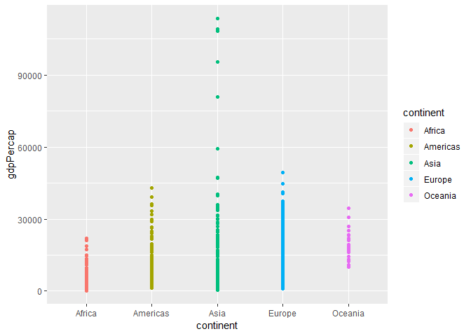
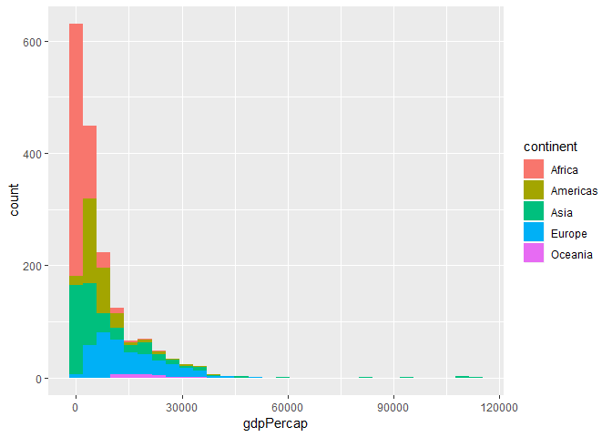
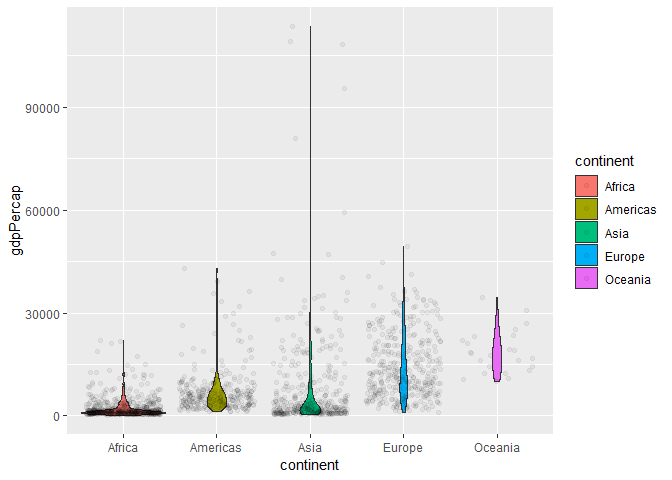
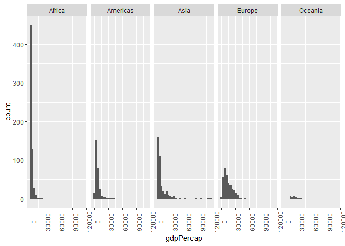
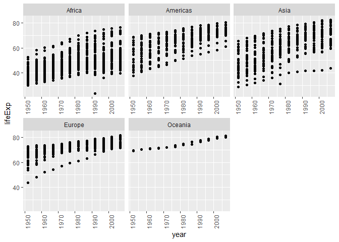

hw03-Meiqiyu
================

# Overview

The goal is to manipulate and explore a dataset with the dplyr package,
complemented by visualizations made with ggplot2.

``` r
library(tidyverse)
```

    ## -- Attaching packages -------------------- tidyverse 1.2.1 --

    ## v ggplot2 3.0.0     v purrr   0.2.5
    ## v tibble  1.4.2     v dplyr   0.7.6
    ## v tidyr   0.8.1     v stringr 1.3.1
    ## v readr   1.1.1     v forcats 0.3.0

    ## -- Conflicts ----------------------- tidyverse_conflicts() --
    ## x dplyr::filter() masks stats::filter()
    ## x dplyr::lag()    masks stats::lag()

``` r
library(gapminder)
```

# 1.Get the maximum and minimum of GDP per capita for all continents.

The Maximum and minimum of GDP per capita for each continent is listed
below.

``` r
gapminder %>% 
  group_by(continent) %>% 
  summarize(gdpPercap_max= max(gdpPercap),
            gdpPercap_min= min(gdpPercap)) 
```

    ## # A tibble: 5 x 3
    ##   continent gdpPercap_max gdpPercap_min
    ##   <fct>             <dbl>         <dbl>
    ## 1 Africa           21951.          241.
    ## 2 Americas         42952.         1202.
    ## 3 Asia            113523.          331 
    ## 4 Europe           49357.          974.
    ## 5 Oceania          34435.        10040.

Meanwhile, it’s a good idea to show the result in a graph. I list the
following two plots both indicating the maximum and minimum value, and
the first graph seems better for this question.

``` r
ggplot(gapminder,aes(continent,gdpPercap))+
  geom_point(aes(color=continent))
```

<!-- -->

``` r
ggplot(gapminder,aes(gdpPercap))+
  geom_histogram(aes(fill=continent))
```

    ## `stat_bin()` using `bins = 30`. Pick better value with `binwidth`.

<!-- -->

# 2.Look at the spread of GDP per capita within the continents.

The spread of GDP per capita within the continents are listed below.

``` r
gapminder %>% 
group_by(continent) %>% 
select(continent,gdpPercap)
```

    ## # A tibble: 1,704 x 2
    ## # Groups:   continent [5]
    ##    continent gdpPercap
    ##    <fct>         <dbl>
    ##  1 Asia           779.
    ##  2 Asia           821.
    ##  3 Asia           853.
    ##  4 Asia           836.
    ##  5 Asia           740.
    ##  6 Asia           786.
    ##  7 Asia           978.
    ##  8 Asia           852.
    ##  9 Asia           649.
    ## 10 Asia           635.
    ## # ... with 1,694 more rows

The first graph is a violin plot which shows the spread of GDP per
capita within the continents clearly.

``` r
ggplot(gapminder, aes(continent, gdpPercap, fill=continent)) +  
  geom_violin()+
  geom_jitter(alpha=0.05)
```

<!-- -->

The second graph contains five histograms for each continent.

``` r
ggplot(gapminder,aes(gdpPercap))+
  facet_grid(~continent)+
  geom_histogram()+
  theme(axis.text.x = element_text(angle = 90))
```

    ## `stat_bin()` using `bins = 30`. Pick better value with `binwidth`.

<!-- -->

``` r
# use the theme function to rotate x axis to avoid overlapping
```

# 3.How is life expectancy changing over time on different continents?

In the table below, the data is organized with year growing for each
continent, so the trends of lifeExp on different continents can be seen
clearly.

``` r
gapminder %>% 
  group_by(continent) %>% 
  select(continent,year,lifeExp)
```

    ## # A tibble: 1,704 x 3
    ## # Groups:   continent [5]
    ##    continent  year lifeExp
    ##    <fct>     <int>   <dbl>
    ##  1 Asia       1952    28.8
    ##  2 Asia       1957    30.3
    ##  3 Asia       1962    32.0
    ##  4 Asia       1967    34.0
    ##  5 Asia       1972    36.1
    ##  6 Asia       1977    38.4
    ##  7 Asia       1982    39.9
    ##  8 Asia       1987    40.8
    ##  9 Asia       1992    41.7
    ## 10 Asia       1997    41.8
    ## # ... with 1,694 more rows

The graph cotains five point plots showing the lifeExp over year on
different continents.

``` r
ggplot(gapminder,aes(year,lifeExp))+
  facet_wrap(~continent, scales = "free_x")+
  geom_point()+
  theme(axis.text.x = element_text(angle = 90))
```

<!-- -->

``` r
# use the theme function to rotate x axis to avoid overlapping
```
